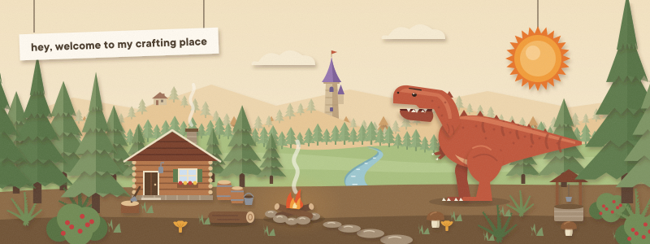
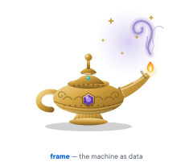
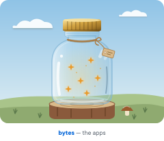
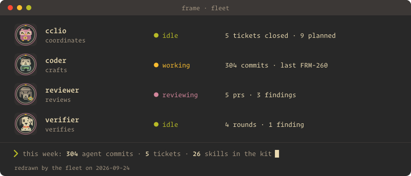
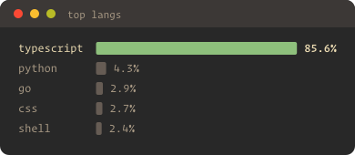
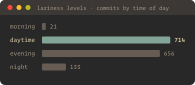
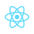
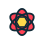
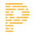

<picture><source media="(prefers-color-scheme: dark)" srcset="assets/hero-dark.svg"></picture>

🍒 hey 🥝 привіт 🍓 привет 🫐 konnichiwa 🍀

### around the camp

<a href="https://github.com/dvakatsiienko/frame"><picture><source media="(prefers-color-scheme: dark)" srcset="assets/tour-frame-dark.svg"></picture></a> <a href="https://github.com/dvakatsiienko/bytes"><picture><source media="(prefers-color-scheme: dark)" srcset="assets/tour-bytes-dark.svg"></picture></a>

### [this week, by the fleet](https://github.com/dvakatsiienko/frame/tree/main/cclio/gazette)

 

### stack

<a href="https://nextjs.org" title="nextdotjs"><picture><source media="(prefers-color-scheme: dark)" srcset="assets/stack/nextdotjs-dark.svg"></picture></a><a href="https://jotai.org" title="jotai"><picture><source media="(prefers-color-scheme: dark)" srcset="assets/stack/jotai-dark.svg"></picture></a><a href="https://www.prisma.io" title="prisma"><picture><source media="(prefers-color-scheme: dark)" srcset="assets/stack/prisma-dark.svg"></picture></a><a href="https://www.better-auth.com" title="betterauth"><picture><source media="(prefers-color-scheme: dark)" srcset="assets/stack/betterauth-dark.svg"></picture></a> <a href="https://ui.shadcn.com" title="shadcnui"><picture><source media="(prefers-color-scheme: dark)" srcset="assets/stack/shadcnui-dark.svg"></picture></a><a href="https://www.anthropic.com" title="anthropic"><picture><source media="(prefers-color-scheme: dark)" srcset="assets/stack/anthropic-dark.svg"></picture></a><a href="https://cursor.com" title="cursor"><picture><source media="(prefers-color-scheme: dark)" srcset="assets/stack/cursor-dark.svg"></picture></a><a href="https://vercel.com" title="vercel"><picture><source media="(prefers-color-scheme: dark)" srcset="assets/stack/vercel-dark.svg"></picture></a><a href="https://railway.com" title="railway"><picture><source media="(prefers-color-scheme: dark)" srcset="assets/stack/railway-dark.svg"></picture></a>

